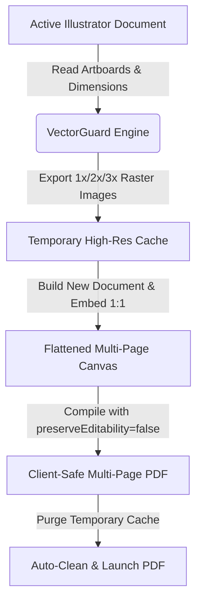

<div align="center">

  

  # 🛡️ VectorGuard PDF Pro
  ### ⚡ 1-Click Client-Safe Flattened Multi-Page PDF Generator for Adobe Illustrator

  <p align="center">
    <a href="https://github.com/yahiabinzaman/VectorGuard-PDF-Pro/releases"></a>
    <a href="https://www.adobe.com/products/illustrator.html"></a>
    <a href="https://github.com/yahiabinzaman/VectorGuard-PDF-Pro/blob/main/LICENSE"></a>
    <a href="https://github.com/yahiabinzaman"></a>
  </p>

  <p align="center">
    <strong>Never send editable vector files to clients again. Automatically export 50–60+ artboards into crystal-clear raster images, perfectly align them onto matching pages, and compile an un-editable multi-page Client PDF in seconds.</strong>
  </p>

</div>

---

## 📌 Table of Contents
- [🎯 The Problem vs The Solution](#-the-problem-vs-the-solution)
- [✨ Key Features](#-key-features)
- [⚙️ How It Works (Pipeline Architecture)](#️-how-it-works-pipeline-architecture)
- [🖥️ UI & Controls Breakdown](#️-ui--controls-breakdown)
- [📦 Installation Guide](#-installation-guide)
  - [Option A: Automated 1-Click Installer (macOS)](#option-a-automated-1-click-installer-macos)
  - [Option B: Manual CEP Extension Setup (Mac & Windows)](#option-b-manual-cep-extension-setup-mac--windows)
  - [Option C: Standalone Script (.jsx)](#option-c-standalone-script-jsx)
- [💡 Best Practices & Pro Tips](#-best-practices--pro-tips)
- [🖥️ System & Version Compatibility](#️-system--version-compatibility)
- [👨‍💻 Author & Credits](#-author--credits)
- [📄 License](#-license)

---

## 🎯 The Problem vs The Solution

When delivering multi-page design mockups (brochures, presentations, social media sets, packaging, UI/UX flows, or merchandise templates with 50–60 artboards), clients frequently request a multi-page PDF for review.

| ❌ The Old Painful Manual Way (15–30 Mins) | ✅ The VectorGuard PDF Pro Way (5 Seconds) |
| :--- | :--- |
| 1. Press `Ctrl + Alt + E` to export all artboards as PNG/JPG. | 1. Click **`🚀 Create Client PDF`**. |
| 2. Locate the exported images inside file explorer. | 2. **Done!** The multi-page flattened PDF is generated, opened, and temporary image caches are auto-deleted. |
| 3. Create a new document in Illustrator with matching artboards. | |
| 4. Drag & drop each image onto its respective artboard manually. | |
| 5. Save as PDF and manually delete the leftover image folders. | |
| ⚠️ **High Risk**: Forgetting to flatten leaves your original vector artwork and source fonts vulnerable to client theft. | 🛡️ **100% Secure**: All vector paths, typography, and layers are completely stripped (`preserveEditability = false`). |

---

## ✨ Key Features

### 🛡️ Complete Vector Asset & Layer Protection
- Embedded rasterization prevents clients or competitors from opening the PDF in Illustrator or Acrobat to extract paths, logos, icons, brand assets, or custom typography.
- Built-in `preserveEditability = false` flag guarantees zero Illustrator Private Data is written into the PDF.

### ⚡ 1-Click Multi-Page Assembly
- Automatically reads the exact coordinate rects and dimensions of all artboards in your active project.
- Re-assembles everything into a clean temporary document with exact 1:1 pixel alignment before outputting the PDF.

### 🎛️ Granular Resolution Controls
- **`1x (100%)`**: Standard preview resolution (~72–150 DPI) for compact file sizes.
- **`2x (200%)`**: ⭐ **Recommended** — High-definition clarity (~300 DPI) for razor-sharp client presentation on Retina & 4K displays.
- **`3x (300%)`**: Ultra high-definition (~450 DPI) for fine detail inspection and print-proof simulation.
- **`Custom Scale`**: Enter any custom percentage (e.g. `150%`, `400%`).

### 🖼️ Raster Format & Transparency Support
- **PNG (24-bit Crisp)**: Lossless rasterization with your choice of **White Background** (standard for multi-page documents) or **Transparent Background**.
- **JPG (Maximum 100% Quality)**: High compression with 100% quality index for fast email / WhatsApp dispatch.

### 📄 Smart Artboard Targeting
- **All Artboards**: Seamlessly batches all pages (1 to 60+).
- **Custom Page Range**: Enter selective ranges like `1-10, 15, 20-35`.

### 🎨 Native Adobe Workspace UI
- Designed with Adobe's native dark UI color tokens (`#323232`, `#262626`, `#1e1e1e`).
- Dockable sidebar panel with live document state detection and progress bar.

---

## ⚙️ How It Works (Pipeline Architecture)



---

## 🖥️ UI & Controls Breakdown

<div align="center">
  
</div>

| Control | Description |
| :--- | :--- |
| **Active Document Card** | Displays the active document name, color space (RGB/CMYK), and total artboards. Includes a **`↻ Refresh`** button. |
| **Resolution / Scale Chips** | Quick selector for `1x`, `2x`, `3x`, or custom scale percentage. |
| **Raster Format Toggle** | Choose between `PNG (24-bit)` and `JPG (Max Quality)`. When PNG is active, background color options (White / Transparent) become selectable. |
| **Artboards To Include** | Switch between `All Artboards` and `Custom Range` (supports comma & hyphen syntax: `1-5, 8, 12`). |
| **Output Destination** | Select destination folder (defaults to current project folder) and set custom PDF file name. |
| **Post-Processing Checkboxes** | Toggle automatic PDF launch upon completion and auto-deletion of temporary image cache. |
| **Developer Footer** | Quick link to developer GitHub profile (**[Yahia Bin Zaman](https://github.com/yahiabinzaman)**). |

---

## 📦 Installation Guide

### Option A: Automated 1-Click Installer (macOS)
1. Download or clone this repository:
   ```bash
   git clone https://github.com/yahiabinzaman/VectorGuard-PDF-Pro.git
   ```
2. Double-click the file:
   ```bash
   install_for_mac.command
   ```
3. Restart Adobe Illustrator.

---

### Option B: Manual CEP Extension Setup (Mac & Windows)

#### 1. Copy the Extension Folder
Copy the `VectorGuard-PDF-Pro` folder into the Adobe CEP extensions directory:

- **macOS**:
  ```bash
  ~/Library/Application Support/Adobe/CEP/extensions/VectorGuard-PDF-Pro
  ```
- **Windows**:
  ```cmd
  C:\Users\<Your_Username>\AppData\Roaming\Adobe\CEP\extensions\VectorGuard-PDF-Pro
  ```

#### 2. Enable PlayerDebugMode (Required for custom CEP panels)
- **macOS (Run in Terminal)**:
  ```bash
  defaults write com.adobe.CSXS.9 PlayerDebugMode 1
  defaults write com.adobe.CSXS.10 PlayerDebugMode 1
  defaults write com.adobe.CSXS.11 PlayerDebugMode 1
  defaults write com.adobe.CSXS.12 PlayerDebugMode 1
  defaults write com.adobe.CSXS.13 PlayerDebugMode 1
  defaults write com.adobe.CSXS.14 PlayerDebugMode 1
  ```
- **Windows (Run in Command Prompt / Registry)**:
  ```cmd
  reg add "HKEY_CURRENT_USER\Software\Adobe\CSXS.9" /v PlayerDebugMode /t REG_SZ /d 1 /f
  reg add "HKEY_CURRENT_USER\Software\Adobe\CSXS.10" /v PlayerDebugMode /t REG_SZ /d 1 /f
  reg add "HKEY_CURRENT_USER\Software\Adobe\CSXS.11" /v PlayerDebugMode /t REG_SZ /d 1 /f
  reg add "HKEY_CURRENT_USER\Software\Adobe\CSXS.12" /v PlayerDebugMode /t REG_SZ /d 1 /f
  reg add "HKEY_CURRENT_USER\Software\Adobe\CSXS.13" /v PlayerDebugMode /t REG_SZ /d 1 /f
  reg add "HKEY_CURRENT_USER\Software\Adobe\CSXS.14" /v PlayerDebugMode /t REG_SZ /d 1 /f
  ```

#### 3. Launch in Illustrator
Restart Adobe Illustrator and navigate to:
**`Window` > `Extensions` > `VectorGuard PDF Pro`**

---

### Option C: Standalone Script (.jsx)
If you prefer running VectorGuard as a standalone script without using the CEP panel:
1. Open your project in Adobe Illustrator.
2. Go to: **`File` > `Scripts` > `Other Script...`** (`Cmd + F12` on Mac / `Ctrl + F12` on Windows).
3. Select [`VectorGuard_PDF_Pro.jsx`](VectorGuard_PDF_Pro.jsx).

---

## 💡 Best Practices & Pro Tips

- 🌟 **Client Presentations**: Use **`2x PNG`** with **White Background** for the optimal balance between razor-sharp text clarity and manageable PDF file size.
- 📱 **Mobile / Messaging Dispatch**: Use **`1x JPG`** if you need a lightweight PDF under 5 MB for WhatsApp or email attachments.
- 🎨 **Spot Color / CMYK Artwork**: The script automatically detects your active document's color space (`RGB` or `CMYK`) to maintain color fidelity during compilation.

---

## 🖥️ System & Version Compatibility

| Requirement | Supported Specifications |
| :--- | :--- |
| **Operating System** | macOS 10.15+ (Intel & Apple Silicon M1/M2/M3/M4) / Windows 10 & 11 |
| **Host Application** | Adobe Illustrator CS6, CC 2018, CC 2019, 2020, 2021, 2022, 2023, 2024, 2025, 2026+ |
| **Runtime Engine** | Adobe CEP 7.0 – 14.0+ |

---

## 👨‍💻 Author & Credits

Crafted with ❤️ by **[Yahia Bin Zaman](https://github.com/yahiabinzaman)**

If this tool saves you time and protects your design assets, please consider giving this repository a ⭐ **Star**!

---

## 📄 License

This project is licensed under the **MIT License** — see the [LICENSE](LICENSE) file for details.
