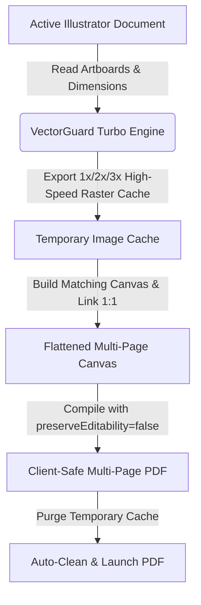

<div align="center">

  

  # VectorGuard PDF Pro
  ### 1-Click Client-Safe Flattened Multi-Page PDF Generator for Adobe Illustrator

  <p align="center">
    <a href="https://github.com/yahiabinzaman/VectorGuard-PDF-Pro/releases"></a>
    <a href="https://www.adobe.com/products/illustrator.html"></a>
    <a href="https://github.com/yahiabinzaman/VectorGuard-PDF-Pro/blob/main/LICENSE"></a>
    <a href="https://github.com/yahiabinzaman"></a>
  </p>

  <p align="center">
    <strong>Never send editable vector files to clients again. Automatically export 50–60+ artboards into crystal-clear raster images, perfectly align them onto matching pages, and compile an un-editable multi-page Client PDF in seconds.</strong>
  </p>

</div>

---

## Table of Contents
- [The Problem vs The Solution](#the-problem-vs-the-solution)
- [Key Features](#key-features)
- [How It Works (Pipeline Architecture)](#how-it-works-pipeline-architecture)
- [UI & Controls Guide](#ui--controls-guide)
- [Installation Guide (Windows & Mac)](#installation-guide-windows--mac)
  - [Windows (1-Click Automated Batch Setup)](#windows-1-click-automated-batch-setup)
  - [macOS (1-Click Automated Command Setup)](#macos-1-click-automated-command-setup)
  - [Standalone Script (.jsx)](#standalone-script-jsx)
- [Best Practices & Pro Tips](#best-practices--pro-tips)
- [System & Version Compatibility](#system--version-compatibility)
- [Author & Credits](#author--credits)
- [License](#license)

---

## The Problem vs The Solution

When delivering multi-page design mockups (brochures, presentations, social media sets, packaging, UI/UX flows, or merchandise templates with 50–60 artboards), clients frequently request a multi-page PDF for review.

| The Old Painful Manual Way (15–30 Mins) | The VectorGuard PDF Pro Way (5 Seconds) |
| :--- | :--- |
| 1. Press `Ctrl + Alt + E` to export all artboards as PNG/JPG. | 1. Click **`Create Client PDF`**. |
| 2. Locate the exported images inside file explorer. | 2. **Done!** The multi-page flattened PDF is generated, opened, and temporary image caches are auto-deleted. |
| 3. Create a new document in Illustrator with matching artboards. | |
| 4. Drag & drop each image onto its respective artboard manually. | |
| 5. Save as PDF and manually delete the leftover image folders. | |
| **High Risk**: Forgetting to flatten leaves your original vector artwork and source fonts vulnerable to client theft. | **100% Secure**: All vector paths, typography, and layers are completely stripped (`preserveEditability = false`). |

---

## Key Features

### Complete Vector Asset & Layer Protection
- Embedded rasterization prevents clients or competitors from opening the PDF in Illustrator or Acrobat to extract paths, logos, icons, brand assets, or custom typography.
- Built-in `preserveEditability = false` flag guarantees zero Illustrator Private Data is written into the PDF.

### High-Speed Turbo Engine (5x–10x Faster)
- Direct linked stream baking eliminates redundant DOM embedding overhead.
- Generates 50–60 page PDFs in seconds.

### Granular Resolution Controls
- **`1x (100%)`**: Standard preview resolution (~72–150 DPI) for compact file sizes.
- **`2x (200%)`**: **Recommended** — High-definition clarity (~300 DPI) for razor-sharp client presentation on Retina & 4K displays.
- **`3x (300%)`**: Ultra high-definition (~450 DPI) for fine detail inspection and print-proof simulation.
- **`Custom Scale`**: Enter any custom percentage (e.g. `150%`, `400%`).

### Raster Format & Transparency Support
- **PNG (24-bit Crisp)**: Lossless rasterization with your choice of **White Background** (standard for multi-page documents) or **Transparent Background**.
- **JPEG (High Quality)**: Optimized compression with 92%–100% quality index for fast email / WhatsApp dispatch.

### Smart Artboard Targeting
- **All Artboards**: Seamlessly batches all pages (1 to 60+).
- **Custom Page Range**: Enter selective ranges like `1-10, 15, 20-35`.

### Native Adobe Workspace UI
- Pure native Adobe CC dark palette (`#323232`, `#232323`, `#1473e6`).
- Dockable sidebar panel with live document state detection and progress bar.

---

## How It Works (Pipeline Architecture)



---

## UI & Controls Guide

| Control | Description |
| :--- | :--- |
| **Document Status Card** | Displays the active document name, color space (RGB/CMYK), and total artboards. Includes a live status indicator dot and **`Refresh`** button. |
| **Resolution / Scale Chips** | Quick selector for `1x`, `2x`, `3x`, or custom scale percentage. |
| **Raster Format Toggle** | Choose between `PNG (24-bit)` and `JPEG (High Quality)`. When PNG is active, background color options (White / Transparent) become selectable. |
| **Artboards To Include** | Switch between `All Artboards` and `Range` (supports comma & hyphen syntax: `1-5, 8, 12`). |
| **Output Destination** | Select destination folder (defaults to current project folder) and set custom PDF file name. |
| **Turbo Mode** | High-speed direct stream compilation (5x–10x faster). |
| **Post-Processing Checkboxes** | Toggle automatic PDF launch upon completion and auto-deletion of temporary image cache. |
| **Developer Footer** | Quick link to developer GitHub profile (**[Yahia Bin Zaman](https://github.com/yahiabinzaman)**). |

---

## Installation Guide (Windows & Mac)

### Windows (1-Click Automated Batch Setup)
1. Download or clone this repository on your Windows PC:
   ```cmd
   git clone https://github.com/yahiabinzaman/VectorGuard-PDF-Pro.git
   ```
2. Double-click **`Install_Windows.bat`**.
   - *It will automatically enable Adobe CEP Debug Mode and install the extension into `%APPDATA%\Adobe\CEP\extensions\`*.
3. Restart **Adobe Illustrator**.
4. Open the panel via: **`Window` > `Extensions` > `VectorGuard PDF Pro`**.

---

### macOS (1-Click Automated Command Setup)
1. Download or clone this repository:
   ```bash
   git clone https://github.com/yahiabinzaman/VectorGuard-PDF-Pro.git
   ```
2. Double-click **`Install_Mac.command`** (or run `bash Install_Mac.command` in Terminal).
3. Restart **Adobe Illustrator**.
4. Open the panel via: **`Window` > `Extensions` > `VectorGuard PDF Pro`**.

---

### Standalone Script (.jsx)
If you prefer running VectorGuard as a standalone script without using the CEP panel:
1. Open your project in Adobe Illustrator.
2. Go to: **`File` > `Scripts` > `Other Script...`** (`Cmd + F12` on Mac / `Ctrl + F12` on Windows).
3. Select [`VectorGuard_PDF_Pro.jsx`](VectorGuard_PDF_Pro.jsx).

---

## Best Practices & Pro Tips

- **Client Presentations**: Use **`2x PNG`** with **White Background** for the optimal balance between razor-sharp text clarity and manageable PDF file size.
- **Mobile / Messaging Dispatch**: Use **`1x JPEG`** if you need a lightweight PDF under 5 MB for WhatsApp or email attachments.
- **Spot Color / CMYK Artwork**: The script automatically detects your active document's color space (`RGB` or `CMYK`) to maintain color fidelity during compilation.

---

## System & Version Compatibility

| Requirement | Supported Specifications |
| :--- | :--- |
| **Operating System** | Windows 10 & 11 (64-bit) / macOS 10.15+ (Intel & Apple Silicon M1/M2/M3/M4) |
| **Host Application** | Adobe Illustrator CS6, CC 2018, CC 2019, 2020, 2021, 2022, 2023, 2024, 2025, 2026+ |
| **Runtime Engine** | Adobe CEP 7.0 – 18.0+ |

---

## Author & Credits

Crafted with care by **[Yahia Bin Zaman](https://github.com/yahiabinzaman)**

If this tool saves you time and protects your design assets, please consider giving this repository a ⭐ **Star**!

---

## License

This project is licensed under the **MIT License** — see the [LICENSE](LICENSE) file for details.
